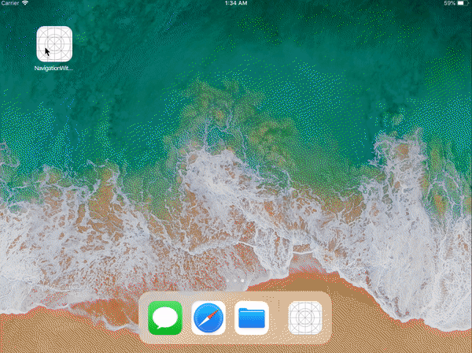
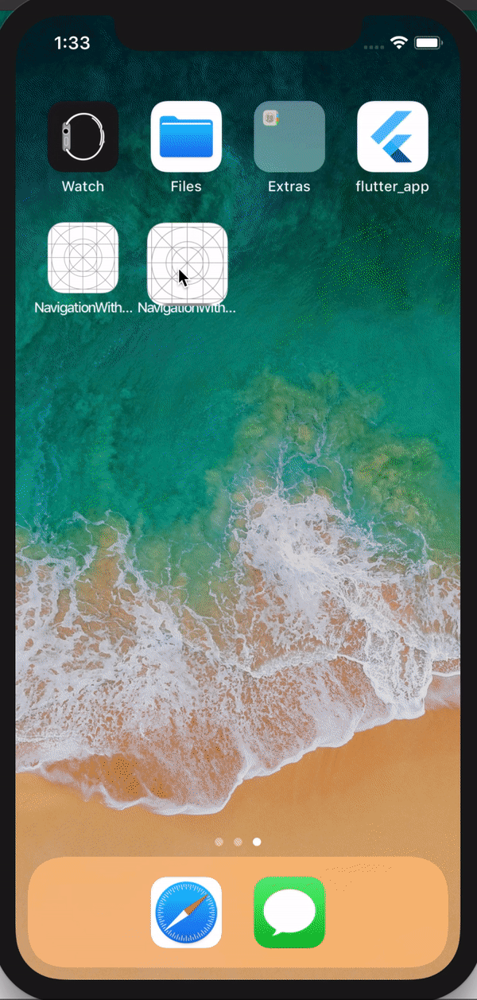

### Implemented using flags and custom navigation controller.  
* Total logic is handled by defining a BaseViewController and a NavigationController. 
* * Base View Controller for displaying menu options, 
* * Navigation Controller for handling Menu Drawer
* Each Menu option is identified by flag. 'OR' applied over these flags results in displaying multiple menu options. 
* Added support for phone and tablet.
* In case of a phone, Menu is displayed as slide-in/out drawer. When on tablet, it is displayed as a popover view controller.

### iPad

### iPhone

